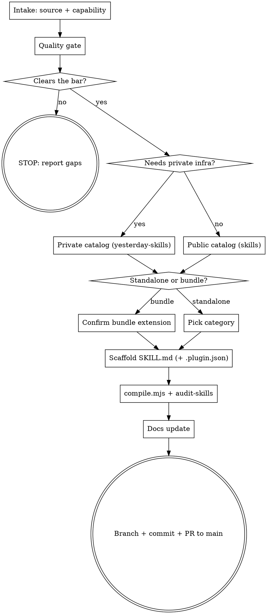

# new-shareable-skill

The authoring counterpart to [`audit-skills`](../audit-skills/SKILL.md): `audit-skills` verifies what is already in the catalog, `new-shareable-skill` gets a skill *into* the catalog correctly. It walks one skill end to end -- intake, quality gate, placement decision, scaffold, compile + audit, docs, PR -- and refuses to scaffold a skill that cannot meet the bar.

This skill is **repo-local tooling**, not a marketplace plugin. It lives in `.agents/skills/` because it must reason about the private `yesterday-skills` catalog and the public↔private routing rules -- naming the private catalog in a marketplace-published skill would be exactly the internal-perspective leak the catalog rules forbid. `compile.mjs` only walks `skills/`, so this skill is never compiled or published.

## When to use

- Adding a brand-new skill to this repo or the private `yesterday-skills` repo
- Promoting a personal / ad-hoc skill (from `~/.claude/skills/`, another repo, or invented in a conversation) into a shareable one
- You have a skill and are unsure which catalog, form (standalone vs bundle), or category it belongs in
- Before a skill PR, to make sure the skill clears the quality bar instead of finding out in review

For the inverse -- checking skills already in the tree for leaks, drift, and spec violations -- use `audit-skills`.

## The two catalogs

| Catalog | Repo | Marketplace name | Audience |
| --- | --- | --- | --- |
| Public | `Yesterday-AI/skills` (this repo) | `yesterday-public-plugins` | every Claude Code / Cursor user worldwide |
| Private | `Yesterday-AI/yesterday-skills` | `yesterday-private-plugins` | Yesterday team; may depend on internal infra |

A skill belongs in the **public** catalog only if BOTH hold (acceptance criterion, `.ytstack/DECISIONS.md` 2026-05-08):

1. It is installable and -- for the no-key paths -- usable by anyone with a stock public Claude Code / Cursor install. SaaS-key-gated skills are fine as long as the SaaS itself is publicly available (Figma, Mistral, ...).
2. It does NOT depend on private hostnames, private package registries, internal-only auth providers, or services that are not publicly reachable.

Anything that fails either test goes in the **private** catalog. Full routing logic, including standalone-vs-bundle and category selection, is in [`references/placement.md`](references/placement.md).

## Procedure

You MUST create a TodoWrite entry for each step and complete them in order. Do not skip the quality gate.

### 1. Intake

Establish three things before touching any files:

- **Source.** Existing skill being made shareable, or new from scratch? If existing: read its current `SKILL.md` + every asset (`references/`, `scripts/`). If new: gather the workflow / knowledge / tool usage from the user until you can write a self-contained `SKILL.md`.
- **Capability.** A one-line statement of what the skill makes an agent able to do. If you cannot write this line, the skill is not ready -- the description frontmatter depends on it.
- **Origin facts.** Where the source lives, whether it carries personal paths / tokens / handles, whether it references private infra. These feed the quality gate and the catalog decision.

### 2. Quality gate

Apply [`references/quality-bar.md`](references/quality-bar.md) -- the "shareable by default" standard. In short:

- **Depersonalize.** Strip usernames in paths, personal hostnames, personal tokens/keys, personal handles. (Blocking in *both* catalogs.)
- **Self-contained.** The skill carries its own knowledge in `SKILL.md` + `references/`. No links to private notes, no un-shared paths, no "ask <person>".
- **No internal-perspective framing** in user-facing fields (description, README, frontmatter, `.plugin.json`). Write from the user's vantage ("install with X", "requires SaaS Y"), not Yesterday's ("no Yesterday-infra deps", "formerly Z"). Migration / org framing belongs in `.ytstack/DECISIONS.md`.
- **Description line.** One paragraph, says what the skill does AND when to invoke it. Routing depends entirely on this line (Anthropic Progressive Disclosure level 1) -- vague description = the skill never fires.
- **Slug.** Specific, self-explanatory, kebab-case, collision-free. Names the concrete capability, not the tool or domain in general (`github-worktrees`, not `github`). Slug = folder name = `.plugin.json` `name`.

If the skill cannot clear the bar, STOP. Report what is missing and what it would take to fix. Do not scaffold a substandard skill into the tree.

### 3. Placement decision

Use [`references/placement.md`](references/placement.md). Three questions:

1. **Which catalog?** Public `skills` vs private `yesterday-skills` -- apply the acceptance criterion above.
2. **Standalone or bundle?** A standalone skill lives at `skills/<category>/<slug>/` and is also installable as its own plugin. Joining a bundle (adding it to a `plugins/<bundle>/skills/` folder or to a bundle's `dependencies[]`) changes what *every existing installer of that bundle* receives -- so bundle extension **requires explicit user confirmation**. Ask before extending a bundle; never do it silently.
3. **Which category?** Standalone only. Pick from the categories that already exist in the target repo; propose a new category only if nothing fits, and confirm it with the user.

### 4. Scaffold

- Write `SKILL.md` with valid frontmatter (`name`, `description`; optional `metadata`) into the chosen path. Template + `.plugin.json` template are in [`references/quality-bar.md`](references/quality-bar.md).
- Add `.plugin.json` next to it for a richer manifest (`author`, `homepage`, `repository`, `license`, `keywords`) -- recommended for standalone skills so the marketplace listing is complete. Without it, `compile.mjs` generates a minimal manifest from frontmatter.
- Place assets under `references/` (knowledge loaded on demand) and `scripts/` (executable helpers).
- **Never add a `version` field** -- the catalog resolves plugins by git SHA on purpose (`.ytstack/DECISIONS.md`, CONTRIBUTING "Versioning").

### 5. Compile + audit

```bash
node compile.mjs
```

Verify the skill appears at `.compiled/skill-plugins/<slug>/` and the marketplace plugin count went up by one:

```bash
node -e "console.log(JSON.parse(require('fs').readFileSync('.compiled/marketplace.json','utf8')).plugins.length, 'plugins')"
```

Then run `audit-skills` (`.agents/skills/audit-skills/SKILL.md`). Zero blocking findings (LEAK / SPEC) is required before the PR. JARGON / INCONSISTENCY findings must be resolved or explicitly justified.

### 6. Docs update

Documentation is part of "done", not a follow-up:

- **Standalone added to a catalog** -> bump the README plugin counts (`N plugins total`, the per-section count) and add a row to the correct category table in that repo's `README.md`.
- **Bundle extended** -> update that bundle's `README.md` "What's in it" section and its `dependencies[]` rationale.
- **New convention introduced** (a new category, a new manifest field, a pipeline change) -> record it in `.ytstack/DECISIONS.md` and, if it affects contributors, `CONTRIBUTING.md` / `AGENTS.md`.
- **Sister-repo parity** -> `skills` and `yesterday-skills` share `compile.mjs`, `clean.mjs`, the OSS scaffold, and the folder/name parity rule. If the change touches any shared file or convention, state in the PR that the sister repo needs the same change.

### 7. PR to main

New skills enter the catalog **only via PR to `main`** -- never a direct push.

```bash
git checkout -b add-<slug>          # branch first; never commit a new skill on main
git add <skill files> <docs> <.ytstack/...>
git commit                          # message: "add <slug>"  (CONTRIBUTING commit format)
git push -u origin add-<slug>
gh pr create --base main --title "add <slug>" --body "<what + why + placement rationale>"
```

CI (`.github/workflows/compile.yml` + `secret-scan.yml`) re-runs compile + a gitleaks scan on the PR. **Never self-merge** -- a new catalog entry needs human signoff. Report the PR link and stop.

## Decision flow



## Output format

Report each phase as you complete it. End with a summary block:

```
new-shareable-skill: <slug>
  Catalog:     public skills | private yesterday-skills
  Form:        standalone (skills/<category>/<slug>/) | bundle member of <bundle>
  Quality:     <N> issues found, <N> fixed   (depersonalization, framing, description, slug)
  Compile:     <N> plugins in marketplace (was <N-1>)
  Audit:       <L> LEAK, <S> SPEC, <J> JARGON, <I> INCONSISTENCY
  Docs:        README counts bumped | bundle README updated | DECISIONS.md entry
  PR:          <url>   (not merged -- awaiting human signoff)
```

## What this skill does NOT do

- **Does not self-merge.** A new catalog entry always needs human signoff. It opens the PR and stops.
- **Does not extend a bundle silently.** Bundle membership changes every existing installer's payload -- it asks first.
- **Does not invent a category to avoid a decision.** Prefers an existing category; a new one is a deliberate, confirmed choice.
- **Does not write the skill's domain content for you.** For a new-from-scratch skill it gathers the knowledge from the user; it will not fabricate a workflow it does not have.
- **Does not edit `.compiled/`.** That tree is regenerated by `compile.mjs` on every run.
- **Does not replace `audit-skills`.** It runs `audit-skills` as step 5; it does not duplicate the leak/consistency/spec scan.

## See also

- [`references/placement.md`](references/placement.md) -- public-vs-private, standalone-vs-bundle, category selection, with the current repo facts
- [`references/quality-bar.md`](references/quality-bar.md) -- the shareable-by-default checklist, the `SKILL.md` + `.plugin.json` templates, the depersonalization checklist
- [`../audit-skills/SKILL.md`](../audit-skills/SKILL.md) -- the verification counterpart; run it as step 5
- `CONTRIBUTING.md` -- adding a standalone skill / bundle / external; commit message format; versioning policy
- `AGENTS.md` -- hard rules for agents working on this repo
- `.ytstack/DECISIONS.md` -- public-installability acceptance criterion; no-internal-perspective rule; no-`version` policy
- company-orga `03_technologies/32_strategy/04_ai-skills-und-plugins.md` -- the "shareable by default" quality standard and the two-catalog strategy
